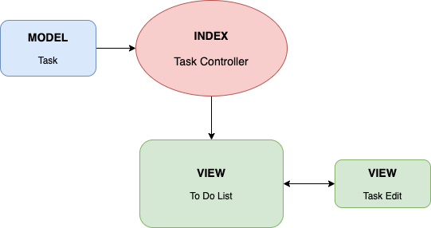

# To Do List

#### _Node JS Application, 2020_

#### By _**Christopher Burge**_

This application is built in node.js and it allows a user to create a list of to-do items. The user is able to add, delete, and update items. 

The data is stored in a file on the server called todolist.json.

### Prerequisites

-Latest version of node.js

-Your favorite IDE

### Installing

- Open Terminal
- Type: ```git clone https://github.com/burgechris/NodeJS_ToDoList```
- Type: ```npm install```
- To Run, type: ```npm start```
- Open your browser and navigate to http://localhost:3000/

## Application Flow and Layout

    

## Authors

* [ChrisBurge](https://github.com/burgechris)

## License

*Open-source*

Copyright (c) 2020 **_Christopher Burge_**
